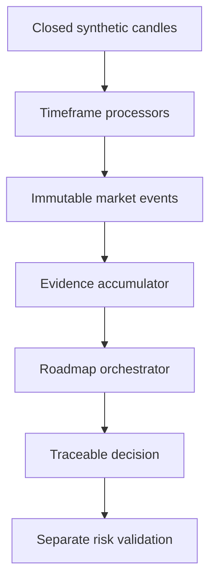

# Multi-Timeframe Decision Platform

Deterministic multi-timeframe decision architecture with explicit evidence, state transitions, and reason codes. This is an engineering demonstration using synthetic data—not financial advice or a trading-performance claim.

## Demonstrated invariants

- Closed candles only: `ClosedAt <= ObservedAt <= DecidedAt`.
- Synthetic Macro (D1), Swing (H1), and Execution (M5) events retain their own closure and observation timestamps; Macro D1 gates Swing H1 context.
- Immutable events become expiring evidence; evidence drives an explicit `RoadmapPhase` state machine.
- Decisions are traceable read models, never orders.
- Duplicate and out-of-order events are rejected with reason codes.
- Replay, paper simulation, and streaming simulation use the same deterministic core.



## Run locally

Requires .NET SDK 10 and Node 24+.

```bash
dotnet run --project src/DecisionPlatform.Api
cd web && npm ci && npm run dev
```

The UI defaults to `http://localhost:5173` and proxies `/api` to the API. Choose a scenario and replay it event by event.

## Test

```bash
dotnet test
cd web && npm ci && npm run build
```

## Deploy

`docker compose up --build` exposes the API on port 8080 and the web UI on port 8081.

## Public boundary

Only fictional scenarios and simplified semantic events are included. There are no exchange adapters, credentials, private strategies, production parameters, or profit metrics.

## License

MIT.

